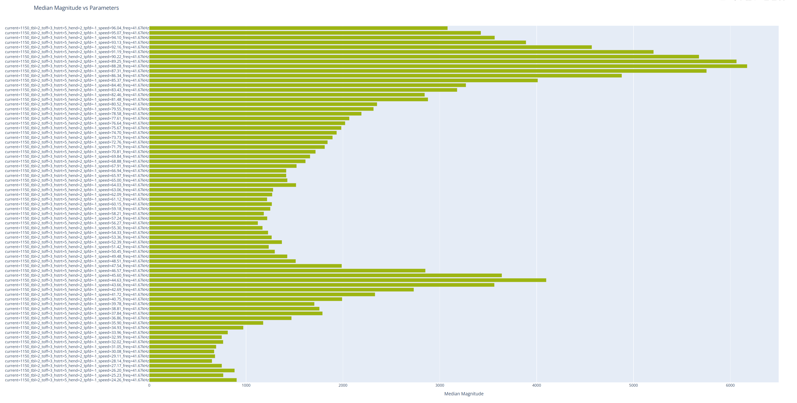
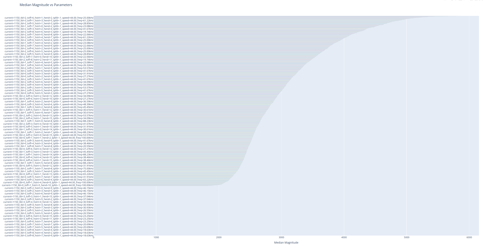
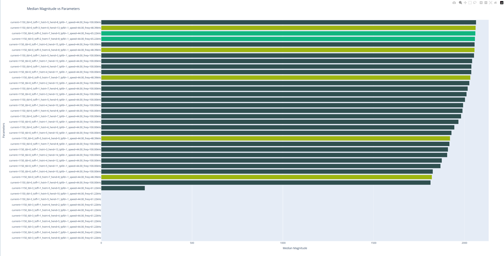
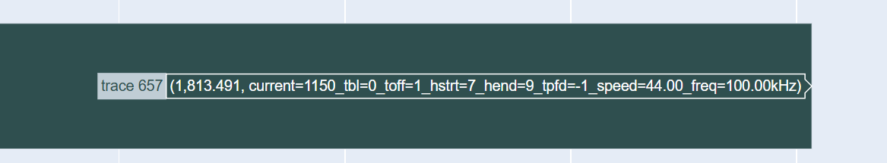

# TMC2240 Chopper Resonance Tuning for X and Y Axes

The QIDI Plus 4 uses [Trinamic TMC2240](https://www.analog.com/en/products/tmc2240.html) stepper motor drivers for the X and Y axes in the default Klipper configuration. However, in order to achieve peak performance, reduce motor noise, and reduce motor vibration, we need to tune our TMC2240 stepper drivers to behave together with the characteristics of the associated motor installed. The TMC2240 comes with a large number of tunables that can be fully in the [Klipper reference](https://www.klipper3d.org/Config_Reference.html#tmc2240). The goal for us is to tune the few most important tunables with the help of the semi-automated [Chopper Resonance Tuner script](https://github.com/MRX8024/chopper-resonance-tuner/tree/main).

This guide is based heavily on the MRX8024 Chopper Resonance Tuning guide, but makes some needed modifications for the purposes of installation into the QIDI Plus 4. The focus on this guide will be tuning the X and Y TMC2240 stepper drivers with the help of the toolhead accelerometer. We will **not** be tuning the Z axis in this guide, as we do not have an accelerometer measuring vibrations of the Z axis motors, nor the extruder. Manual tuning is possible, but not covered under this guide. 

> [!TIP]
> A full Chopper calibration suite across X and Y axes will take upwards of 3+ hours on the Plus4. Most of the process is hands-off, but the printer will not be usable during that window.

## Script Installation

> [!TIP]
> Do not follow the automated installation found in the Chopper Resonance Tuner repository. Certain packages are out of date on the Plus 4's mainboard, and therefore the automated installation will fail. Follow all steps here carefully as doing them improperly may jeopardize your mainboard's OS or stability. 

1. `ssh` into the QIDI Plus 4, following the [typical steps](../ssh-access/readme.md).

```
ssh mks@<ip-address>
```

2. Create a folder for the output files, by default - `mkdir ~/printer_data/config/adxl_results/chopper_magnitude`

3. Clone the Chopper Resonance Tuner repository to your home directory.

```
cd ~

git clone https://github.com/MRX8024/chopper-resonance-tuner
```

4. Create a symbolic link from the repository to your printer config

```
ln -sf ~/chopper-resonance-tuner/chopper_tune.cfg ~/printer_data/config/
```

5. Debian Buster has recently moved its repositories. Run the following to fix up the printer's repo references.

```
sudo sed -i -e '/security\.debian\.org/ s/^deb/#deb/g' -e 's!deb\ http\:\/\/deb\.!deb\ http\:\/\/archive\.!' /etc/apt/sources.list
```

6. Install certain dependencies for the Chopper Resonance Tuner script.

```
sudo apt-get install libatlas-base-dev libopenblas-dev

python3.7 -m pip install --upgrade --user plotly numpy tqdm matplotlib
```

7. Include the following line in your `printer.cfg` file, towards the top. This includes the newly downloaded Chopper Resonance Tuner macros, making them ready for use by Klipper.

```
[include chopper_tune.cfg]
```

8. (Optional) Add an update section to moonraker for subsequent updates via Fluidd update managers. Include the following at the end of your `moonraker.conf` file.

```
[update_manager chopper-resonance-tuner]
type: git_repo
path: ~/chopper-resonance-tuner/
origin: https://github.com/MRX8024/chopper-resonance-tuner.git
primary_branch: main
managed_services: klipper
```

9. Run a Firmware Restart through Fluidd. Once the restart is complete, Chopper Resonance Tuner should now be fully installed and ready for use.

You will now also have a folder called `adxl_results` in your configuration root folder accessible through Fluidd. Note that the Chopper Resonance Tuner script will put a number of outputs into that folder, so please be sure you can find it.

## How the Calibration Works

The Chopper Resonance Tuner macros/script we installed operates by rattling your specified axis with various different motor setting permutations, and then outputting a graph of the measured accelerometer deviations. We then will review the graph and pick the combination of settings which give us the minimal accelerometer deviations across the five setting permutations.

Be mindful that full calibration of each axis will take upwards of 1.5-2hrs each. The printer will not be usable during this time and will make repeated movements throughout.

## Running the Calibrations

The following steps assume that you are calibrating your **X-axis** motor and driver. Because of the Plus 4's CoreXY kinematics, regardless if you are calculating your X or Y axis, you will be running calculations for both drivers at the same time. Therefore, there is no need to specify an axis.

### Checking Vibrations

Before we run our Chopper calibration, we should first figure out at what speeds our motors are most susceptible to vibrations. Chopper includes a vibration test script. 

Run the following command in your console:

```
CHOPPER_TUNE FIND_VIBRATIONS=1
```

When this completes (~6-10min), you will have a HTML file found in `adxl_results/chopper_magnitude`. Download that file by right clicking it and clicking "Download". Open the HTML file in your browser and you will have a bar chart similar to the below.



You should notice two peaks in the chart, one around 85-90mm/s and one around 40-50mm/s. Depending on your exact printer, your speeds where the peaks appear may differ from the example shown here. Based on my chart, my peaks were at approximately 44mm/s and 88mm/s. 

Make a note of the **lower** peak. You will need this speed value in the subsequent steps. Throughout the rest of the calibration, this guide will assume your peak value is at 44mm/s, but be sure to replace it with your own peak.

### Chopper Tuning Sweeps

Next, we will run a set of Chopper tuning sweeps. This process will try every permutation of the following TMC2240 driver registers and measure the resulting accelerometer deviation for each: `TBL`, `TOFF`, `HSTRT`, `HEND`. While it is possible to run each of these values iteratively to cut down on the tuning time, it is recommended to get a full sweep of all possible combinations of all 4 parameters in case some esoteric combination works out best for your printer.

This process will take the bulk of the time (~2hr) and cannot be canceled without shutting the printer off. Progress is not saved in the interim and if you end the process prematurely, you will need to run the entire test again. 

When ready, run the following command to begin testing. The printer will make X-axis sweeps a couple thousand times (2520 to be exact). Be sure to replace the `44` value with the speed from earlier.


```
CHOPPER_TUNE MIN_SPEED=44 MAX_SPEED=44
```

Once this command has completed running, you will have two HTML files in the `adxl_results/chopper_magnitude` folder. Download that HTML that contains `sorted` in the name and open that file in your browser. You will have a large bar chart similar to the below:



Currently, it will be impossible to see the detailed results. Additionally, you will likely have a number of entries without a bar. That is fine as it simply means our motor has not responded to those TMC2240 values. 

Zoom into the bar chart towards where the values are the lowest by drawing a box around the area. Continue to zoom in until you are able to clearly see the individual data points.



If you see any outliers like in the example data, with one bar far lower than the rest, ignore that row. The motor simply did not respond properly to that test point. 

Make a note of the **lowest** reasonable value in that chart.



The string inside of the bar when hovering will contain the values of the parameters tested: `TBL`, `TOFF`, `HSTRT`, `HEND`, with each following the equals sign. Make a note of those values as they are now your best values for this axis. 

You may also want to make a note of the second-to-lowest set of parameters as well. We can run comparison tests to double check our results later.

#### Additional `TPFD` Tuning

Because our Plus 4 is running TMC2240's, we have access to an additional parameter: `TPFD`. Now that we have our ideal values for the other four parameters, we can now tune TPFD relatively quickly, by sweeping through only the allowed ranges of TPFD.

We can do this with the below command, replacing your "best values" from the prior step, and the "speed" from the vibration test. The command below assumes my best values, but sure to replace them with your own.

```
CHOPPER_TUNE TBL_MIN=0 TBL_MAX=0 TOFF_MIN=1 TOFF_MAX=1 HSTRT_MIN=7 HSTRT_MAX=7 HEND_MIN=9 HEND_MAX=9 TPFD_MIN=0 TPFD_MAX=15 MIN_SPEED=44 MAX_SPEED=44 ITERATIONS=2
```

> [!NOTE]
> Be sure to replace each parameter's min and max value in the above command with your own results. As well, ensure that min speed and max speed are set to your earlier speed test.

This command will run the sweep of TPFD from range 0 through 15, trying each result twice and averaging. Similar to the prior step, you will have a bar graph in the same output folder. Download the sorted result and determine the `TPFD` value which results in the lowest deviation.

You may want to run this `TPFD` tuning with your second-best values from the full sweep as well.

#### Fine Tuning

Now that we have all five parameters and have determined our "best values", we can run some additional checks to ensure that our values are accurate. You should determine how much you want to check these values based on your willingness and time available. 

You simply run any combination of `CHOPPER_TUNE` commands with any number of `ITERATIONS` to collect as much data as desired. 

The `CHOPPER_TUNE` command accepts minimum and maximum values for each of `TBL`, `TOFF`, `HSTRT`, `HEND`, and `TPFD`. To make it run a sweep between a range, set `MIN` and `MAX` to different values. To keep a parameter constant, set `MIN` and `MAX` to be the same.

Since we have our "best values" and also our "second-to-best" values from the full sweep, we can run a multi-iteration pass on each of those determine which of those is actually giving us the least vibrations:

```
CHOPPER_TUNE TBL_MIN=0 TBL_MAX=0 TOFF_MIN=1 TOFF_MAX=1 HSTRT_MIN=7 HSTRT_MAX=7 HEND_MIN=9 HEND_MAX=9 TPFD_MIN=6 TPFD_MAX=6 MIN_SPEED=44 MAX_SPEED=44 ITERATIONS=10


CHOPPER_TUNE [replace with your second-best values] ITERATIONS=10
```

> [!NOTE]
> Be sure to replace each parameter's min and max value in the above command with your own results. As well, ensure that min speed and max speed are set to your earlier speed test.

Compare the deviations generated from your bar graphs, and see which of the two actually give you the lowest deviation based on a higher number of iterations.

Note down those values as they are now our final parameter values.

### Inputting into Klipper

Now that we have our final values, we can include them into our `printer.cfg` file. 

1. Edit your `printer.cfg` file and look for the section:

```
[tmc2240 stepper_x] 
```

and 

```
[tmc2240 stepper_y]
```

2. Add the following lines at the end of **each** section:

```
driver_SGT: 1       # Do NOT change this line. It should be set to 1.
driver_TBL: X       # Replace with your best TBL value
driver_TOFF: X      # Replace with your best TOFF value
driver_HSTRT: X     # Replace with your best HSTRT value
driver_HEND: X      # Replace with your best HEND value
driver_TPFD: X      # Replace with your best TPFD value
```

> [!NOTE]
> Be sure to replace each X with your best-value from earlier.

3. (Optional) It is recommended to change `interpolate` to `false` in that same section. However, doing so is not required, but will result in higher accuracy. 

### Finishing Up

With these new driver values in place, it is best to run an input shaper calibration again. This can be done either on the Plus 4's screen or by sending the macro `SHAPER_CALIBRATE` to your console.

### Credits

- [Chopper Resonance Tuner](https://github.com/MRX8024/chopper-resonance-tuner) for the script and the basic guide
- [Stew675's Klipper Shake&Tune README](https://github.com/stew675/klippain-shaketune-for-qidi-plus4) for updates to the Debian `apt` repositories
